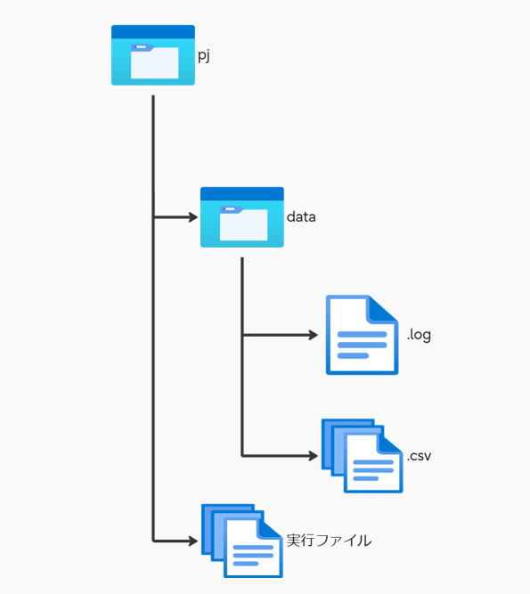

# システム操作マニュアル（システムVer.1.0.2）
---

※システムを動作させる前に読んでください。
<br>

### Pythonインストール手順

- 以下のサイトにアクセス
https://www.python.org/downloads/


自身のOSに対応するものから、バージョン3.11.8を選択し、ダウンロード


  
  - ダウンロードしたものを実行する
  1. "Add Python3.11.8 to PATH"にチェックを入れる。
  2. Install now をクリックし、インストールを開始。
  3. インストールが完了すると”Setup was successful”と書かれたWindowが表示されます。
  4. 正常にインストールされたことをチェックするため、コマンドプロンプトを起動して以下コマンドを入力して実行します。
   
   ```
 python -V
 ```
 「Pyrhon3.11.8」と表示されていれば成功

   <br>
   
  ##### Pythonが正しくインストールされているかを確認
  1. コマンドプロンプトを起動。
  2. 以下に示したコマンドを実行する。
   
   ```
python 
   ```
```
print('Hello World')
```
Hello Worldとコンソールに表示されていれば成功。

Pythonを終了する際は、quit()と入力またはCtrl + Zで終了可能。

---


## Pythonファイル実行
  1. コマンドプロンプトを起動
  2. 以下に示したコマンドを実行する（[前提条件](#前提条件)は後述記載）
   
仮に展開したフォルダに移動
```
cd フォルダ名
```
pjディレクトリに移動
   ```
cd pj
   ```
  pjディレクトリに移動できたらシステムの実行を行う
   ```
python total.py
   ```
  処理が開始されると以下のメッセージが表示される

   ```
[Info] 2024/xx/xx 14:30:10, INFO001, 処理を開始します
   ```
処理が正常に終了した場合は以下のメッセージが表示され、pjディレクトリ内に結果ファイル"result.csv"が出力される
   ```
[Info] 2024/xx/xx 14:30:11, INFO002, 処理が終了しました
   ```
問題が発生した場合は[エラーが出た場合](#エラーが出た場合)を参照し、エラーメッセージに応じた対処する

---
<a id="前提条件"></a>
・前提条件(ファイル構成)



| フォルダ階層| フォルダ名 | 格納物 　|
|:-----------|:------------|:------------|
| 1階層      | pj          | dataフォルダ, 実行ファイル             |
| 2階層      | data        | .logファイル, .csvファイル(複数)       |

※データ集計に関係のないファイル等はフォルダ内に配置しないでください。正常に動作できない場合があります。

<br>

---
## エラーが出た場合
<a id= "エラーが出た場合"></a>

| メッセージID| 対処方法 |
|:-----------|:------------|
| UERR001    |./dataの配下に*.csvの拡張子のついたファイルを置く          | 
| UERR002    |./dataの配下に*.logの拡張子のついたファイルを置く     | 
| UERR003    | 中身が記載されており、フォーマットが正しいログファイルを読み込ませる    | 
| UERR004    |()内を確認し、何も書かれていないまたは数字以外が入っていないかを確認し修正する   |
| UERR005    |中身が記載されており、フォーマットが正しいCSVファイルを読み込ませる       | 
| UERR006    |[ ]の中に空白、または数字以外が入っていないか確認し、修正する       |
| UERR007    |CSVファイル内のヘッダー行を確認し、"PR_name"を追加する       | 
| UERR008    | CSVファイル内のヘッダー行を確認し、"ID"を追加する       |
| UERR009    | CSVファイル内のヘッダー行を確認し、"service_used#Id"を追加する    | 
| UERR010    | pjフォルダ内にdataフォルダを設置する  | 

